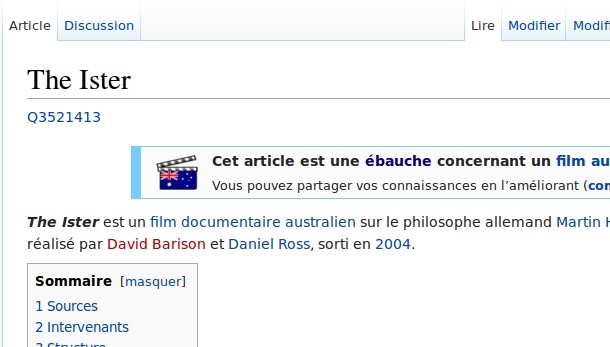

# wikidata-links-enhancer

Display wikidata links under any wikimedia projects pages (specifically wikipedia in all languages) just after the header.
Inspired from [Shonagon's script](https://fr.wikipedia.org/wiki/Utilisateur:Shonagon/wikidata_item.js)



## Installation

### As a Wikimedia user script

Add this line to [your global.js page](https://meta.wikimedia.org/wiki/special:MyPage/global.js)
```sh
mw.loader.load( '//meta.wikimedia.org/w/index.php?title=User:Maxlath/wikidata_header_link_everywhere.js&action=raw&ctype=text/javascript' );
```

* See [source code](https://meta.wikimedia.org/wiki/User:Maxlath/wikidata_header_link_everywhere.js)
* See [my `global.js`](https://meta.wikimedia.org/wiki/User:Maxlath/global.js) for reference

### As a browser user script
Can be installed on Firefox or Chrome as any user script, see the [documentation of an other user script project](https://github.com/GuGuss/ARTE-7-Downloader/blob/master/README.md) or on [greasyfork.org](https://greasyfork.org/fr/scripts/6471-wikidata-links-enhancer) (the site replacing userscripts.org)

#### Elsewhere
* on [greasyfork.org](https://greasyfork.org/fr/scripts/6471-wikidata-links-enhancer)
